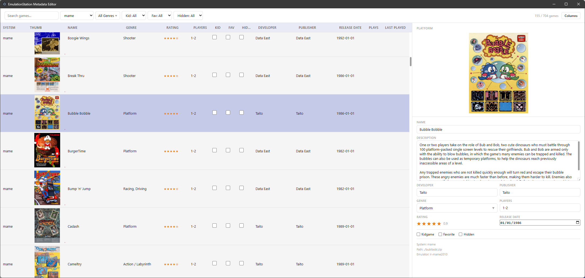

# EmulationStation Metadata Editor

A desktop app for bulk-editing EmulationStation `gamelist.xml` files. Built for managing large ROM collections across network shares — point it at your ROMs folder and edit metadata for hundreds of games in a single unified view.



## Why this exists

EmulationStation stores game metadata (names, genres, ratings, kid-safe flags, etc.) in per-system `gamelist.xml` files scattered across dozens of folders. Editing them by hand is tedious. This app loads every gamelist it finds, merges them into one searchable, sortable, filterable table, and lets you bulk-edit fields — then writes only the changed files back to disk.

The primary use case is **bulk-toggling the `kids`, `favorites` and `hidden` flags** across an entire collection, but it handles full metadata editing for any field.

## Features

- **Unified game list** — All games from all systems in a single virtual-scrolled table
- **Inline editing** — Click any row to open a side panel editor with all metadata fields
- **Bulk boolean toggles** — Kidgame, Favorite, and Hidden columns have clickable checkboxes directly in the table
- **Rich filtering** — Multi-select dropdowns for systems and genres, tri-state filters for Kid/Fav/Hidden, free-text search
- **Star rating editor** — Click or drag across stars for precision rating (0.0–1.0)
- **Genre picker** — Multi-select dropdown with all known genres from your collection
- **Thumbnail preview** — 128px thumbnails in every row, full image in the side panel
- **Network share support** — Works with UNC/CIFS paths (e.g. `\\server\share\roms`) and local paths
- **Smart image resolution** — Resolves relative paths, `(usb0)/` subdirectories, and `/rcade/` absolute paths
- **Safe saves** — `.bak` backups before first write, atomic writes via `.tmp` rename
- **Explicit save** — Changes accumulate in memory; save when ready, discard to revert
- **Persistent preferences** — Remembers last path, column visibility across sessions
- **Loading progress** — Live progress bar during gamelist scanning and image resolution
- **OS theme** — Follows system light/dark mode
- **Keyboard shortcuts** — `Ctrl+S` to save

## Tech Stack

| Layer | Technology |
|-------|-----------|
| Shell | Electron |
| Frontend | React 19, TypeScript |
| Build | electron-vite (Vite) |
| Data grid | TanStack Table v8 + TanStack Virtual |
| State | Zustand |
| XML | fast-xml-parser |
| Testing | Playwright (E2E) |

## Getting Started

```bash
# Install dependencies
npm install

# Run in development mode (hot reload)
npm run dev

# Build production executable
npm run build:exe
# Output: dist/win-unpacked/es-metadata-editor.exe
```

## Scripts

| Command | Description |
|---------|-------------|
| `npm run dev` | Start in development mode with hot reload |
| `npm run build` | Typecheck and build for production |
| `npm run build:exe` | Build a standalone Windows executable |
| `npm run build:win` | Build Windows installer (NSIS) |
| `npm run test:e2e` | Run Playwright end-to-end tests |
| `npm run typecheck` | Run TypeScript type checking |

## How It Works

1. **Point to your ROMs folder** — Enter a local or UNC path. The app scans all subdirectories for `gamelist.xml` files.
2. **Browse and filter** — Use the toolbar filters to narrow down by system, genre, or boolean flags. Search by name or description.
3. **Edit** — Click checkboxes in the table for quick toggles. Click a row to open the side panel for full editing (name, description, genre, rating, dates, etc.).
4. **Save** — The save bar shows pending change count. Hit Save (or `Ctrl+S`) to write modified XML files. Only changed files are written; each gets a `.bak` backup on first save.

## XML Format

The app reads and writes standard EmulationStation `gamelist.xml`:

```xml
<gameList>
  <game path="./romfile.ext">
    <name>Game Name</name>
    <desc>Description</desc>
    <image>./downloaded_images/game.png</image>
    <genre>Puzzle-Game</genre>
    <rating>0.6</rating>
    <kidgame>true</kidgame>
    <!-- ... other fields ... -->
  </game>
</gameList>
```

## License

This project is licensed under the [Creative Commons Attribution-NonCommercial-ShareAlike 4.0 International License](https://creativecommons.org/licenses/by-nc-sa/4.0/).

Copyright (c) 2026 Bruno Figueiredo — see [LICENSE.md](LICENSE.md) for details.
